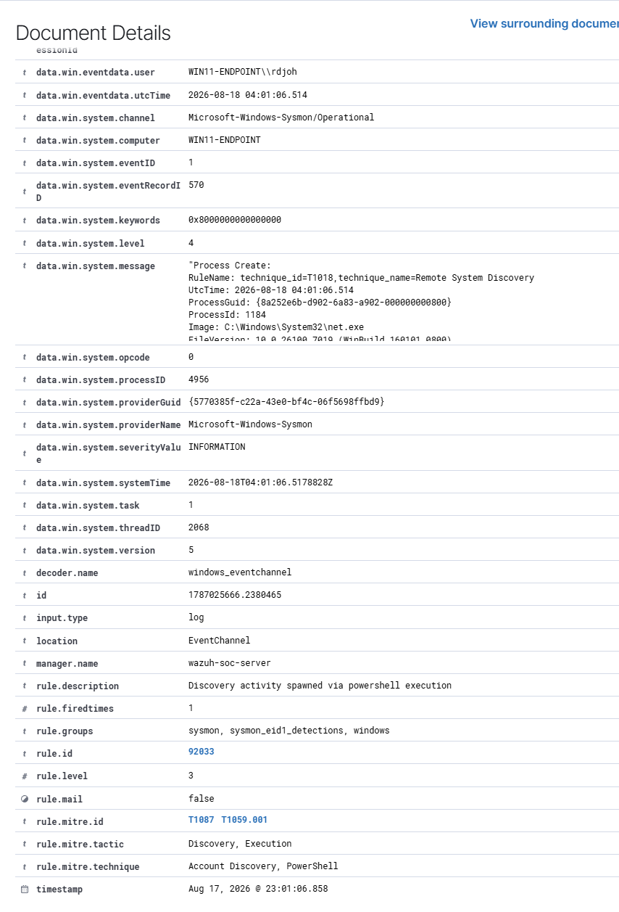
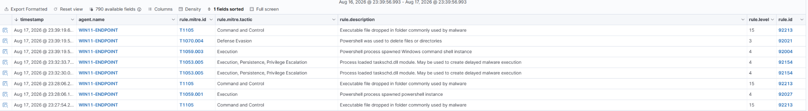
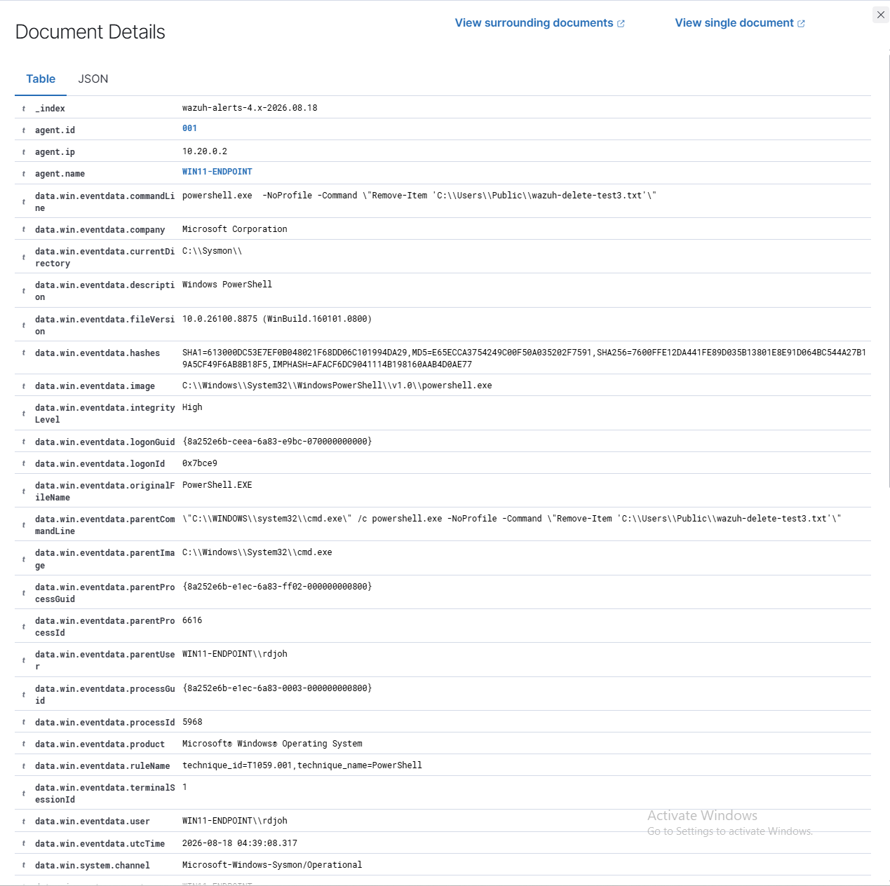
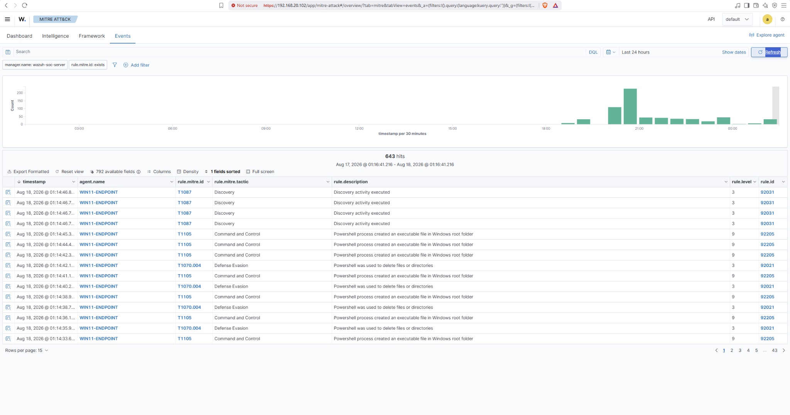

# Wazuh + Sysmon SOC Monitoring Lab

## Overview

This project demonstrates a hands-on Security Operations Center (SOC) monitoring environment built using Wazuh, Sysmon, Windows 11, and Ubuntu Server.

The goal of the lab was to gain practical experience with endpoint monitoring, log collection, security event analysis, and MITRE ATT&CK-mapped detections.

A Windows 11 endpoint was configured with Sysmon to generate detailed endpoint telemetry. The Wazuh agent collected the Windows and Sysmon events and forwarded them to a Wazuh server for analysis. Controlled security events were then generated to verify that Wazuh could detect, classify, and map the activity to MITRE ATT&CK techniques.

## Lab Architecture

The lab was built in Oracle VirtualBox using two virtual machines connected through an isolated internal lab network.

- **Wazuh Server**
  - Ubuntu Server
  - Wazuh Manager and Dashboard
  - Internal SOC-LAB IP: `10.20.0.1`

- **Windows 11 Endpoint**
  - Windows 11 Pro
  - Wazuh Agent
  - Sysmon
  - Internal SOC-LAB IP: `10.20.0.2`

### Telemetry Flow

Windows 11 Endpoint  
→ Sysmon  
→ Windows Event Log  
→ Wazuh Agent  
→ Wazuh Manager  
→ Detection Rules  
→ MITRE ATT&CK Alerts

## Tools & Technologies

- **Wazuh** — SIEM/XDR platform used for log collection, analysis, alerting, and MITRE ATT&CK mapping
- **Sysmon** — Windows system monitoring tool used to generate detailed endpoint telemetry
- **Windows 11 Pro** — Monitored endpoint
- **Ubuntu Server** — Hosted the Wazuh Manager and Dashboard
- **Oracle VirtualBox** — Virtualization platform used to host the lab environment
- **PowerShell** — Used to generate controlled activity and perform endpoint configuration
- **MITRE ATT&CK** — Framework used to classify and understand detected techniques

## Implementation

### Wazuh Server

- Installed and configured Wazuh on an Ubuntu Server virtual machine.
- Configured the Wazuh Manager and web dashboard.
- Verified communication between the Wazuh server and the Windows endpoint.
- Enrolled the Windows endpoint as a Wazuh agent.

### Windows Endpoint

- Installed the Wazuh agent on Windows 11 Pro.
- Configured the endpoint to communicate with the Wazuh server over the isolated SOC-LAB network.
- Installed Sysmon using a Wazuh-compatible Sysmon configuration.
- Configured the Wazuh agent to collect events from the `Microsoft-Windows-Sysmon/Operational` event channel.
- Verified Sysmon process creation events were successfully forwarded to the Wazuh server.

### Detection Validation

Controlled activity was generated on the Windows endpoint to verify that the telemetry pipeline and Wazuh detection rules were functioning correctly.

The testing process followed this workflow:

`Activity Generated → Sysmon Event → Wazuh Agent → Wazuh Detection Rule → MITRE ATT&CK Mapping`

## Detection 1: Account Discovery

To simulate account discovery activity, the following command was executed on the Windows 11 endpoint:

```powershell
net user
```

Sysmon captured the process creation event and forwarded the telemetry through the Wazuh agent.

Wazuh detected the activity using rule `92033` and mapped it to:

- **T1087 — Account Discovery**
- **T1059.001 — PowerShell**
- **Tactic:** Discovery / Execution

This confirmed that endpoint process activity was being successfully collected, analyzed, and mapped to MITRE ATT&CK techniques.




## Detection 2: File Deletion

To simulate file deletion behavior, a harmless test file was created and then deleted using PowerShell:

```powershell
cmd.exe /c powershell.exe -NoProfile -Command "Remove-Item 'C:\Users\Public\wazuh-delete-test3.txt'"
```

Sysmon captured the PowerShell process creation event, including the command line and parent process information.

Wazuh detected the activity using rule `92021` and mapped it to:

- **T1070.004 — File Deletion**
- **Tactic:** Defense Evasion

This test demonstrated how endpoint telemetry can be used to detect file deletion activity that may be associated with attempts to remove artifacts or evidence from a compromised system.



### Event Details

The detailed event showed the PowerShell `Remove-Item` command, the `powershell.exe` process, and `cmd.exe` as its parent process.



## Overall Detection Results

After configuring Sysmon and Wazuh, the Windows endpoint successfully generated multiple MITRE ATT&CK-mapped alerts.

Observed techniques included:

- **T1087 — Account Discovery**
- **T1070.004 — File Deletion**
- **T1105 — Ingress Tool Transfer**
- Additional PowerShell and process execution activity

The Wazuh MITRE ATT&CK dashboard provided a centralized view of detected activity, associated tactics, detection rules, and severity levels.



## Troubleshooting & Lessons Learned

Several issues were encountered while building and validating the lab.

### Sysmon Configuration Compatibility

An older Sysmon configuration initially failed because its schema version was incompatible with the installed Sysmon version. A current Wazuh-compatible configuration was downloaded and validated before reinstalling Sysmon.

### Overlapping Wazuh Detection Rules

During the file deletion test, the initial activity triggered a PowerShell process-spawning rule instead of the expected File Deletion rule.

The Wazuh ruleset was inspected directly to compare the matching conditions. The test was adjusted so that `cmd.exe` launched PowerShell, allowing the intended rule `92021` to detect the file deletion activity and map it to `T1070.004`.

### Log Source Validation

When testing additional PowerShell detections, Windows was confirmed to be generating PowerShell Event ID `4104`, but the Wazuh agent was not initially collecting the PowerShell Operational event channel.

This reinforced the importance of validating each stage of the telemetry pipeline instead of assuming that an expected alert will automatically appear.

## Key Takeaways

- Learned how endpoint telemetry flows from Sysmon into a SIEM.
- Gained experience deploying and troubleshooting a Wazuh agent.
- Practiced investigating alerts using process, command-line, and parent-process information.
- Used MITRE ATT&CK mappings to understand detected behavior.

## Conclusion

This lab provided hands-on experience building and validating an endpoint monitoring pipeline using Wazuh and Sysmon.

The project strengthened practical skills in log collection, endpoint telemetry, detection analysis, MITRE ATT&CK mapping, and troubleshooting security monitoring workflows.
- Learned how overlapping detection rules can affect which alert is generated.
- Improved troubleshooting by validating each layer of the monitoring pipeline individually.
